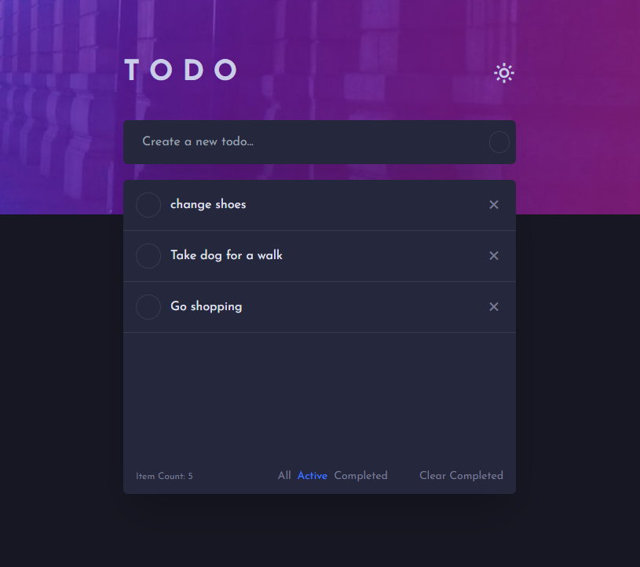

# Frontend Mentor - Todo app solution

This is a solution to the [Todo app challenge on Frontend Mentor](https://www.frontendmentor.io/challenges/todo-app-Su1_KokOW). 

## Table of contents

- [Overview](#overview)
  - [The challenge](#the-challenge)
  - [Screenshot](#screenshot)
  - [Links](#links)
- [My process](#my-process)
  - [Built with](#built-with)
  - [What I learned](#what-i-learned)
- [Author](#author)

## Overview

### The challenge

Users should be able to:

- View the optimal layout for the app depending on their device's screen size
- See hover states for all interactive elements on the page
- Add new todos to the list
- Mark todos as complete
- Delete todos from the list
- Filter by all/active/complete todos
- Clear all completed todos
- Toggle light and dark mode
- All todos are saved in the database.

### Screenshot

### Links

- Solution URL: [Repository](https://github.com/04stefke/todo-app-challenge)
- Live Site URL: [Live Demo](https://to-do-challenge-by-stefan.netlify.app)

## My process

### Built with

- Semantic HTML5 markup
- CSS custom properties
- Flexbox
- Tailwind
- Mobile-first workflow
- [React](https://reactjs.org/) - JS library

### What I learned

I have learned how to build a Todo App with React and Backend with Firebase. All todos can be added, updated or removed from the backend.

## Author

- Website - [Stefan Jovanovic](https://stefans-personal-website.netlify.app/)

